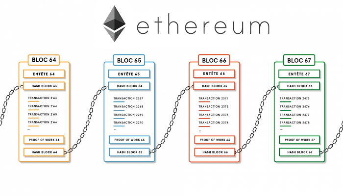

## web3j - 以太坊开发  

### 关于以太坊

* 以太坊是备受关注的区块链，它基于密码学技术和P2P通信技术 构建了一个去中心化的平台，所有的交易同步保存在每个节点中， 通过将区块单向级联成链，以太坊有效的保证了交易的不可篡改

* 以太坊是第一个实现了虚拟机的区块链，因此为智能合约 - Smart Contract - 的运行提供了良好的支持环境。也正因为这个原因，以太坊被称为区块链 2.0，以区别于比特币代表的以数字加密货币为核心特征的区块链1.0

* 可以将智能合约理解为机器之间的合同约定，在满足一定条件时自动 执行约定好的逻辑，例如在保险理赔流程中，如果理赔条件满足就自动 将赔偿金释放给出险人，这个流程就可以使用智能合约来实现。

* 有多种语言可以开发以太坊智能合约，但目前最常用的是类似于JavaScript的 Solidity语言。本课程中将采用Solidity讲解智能合约的开发。

* 目前币圈流行的 shib、uni等代币都是eth链上的智能合约

* 以太坊概述

    - [JSON RPC与web3j](docs/JSONRPC_web3j.md)  
    - [org.web3j](docs/org.web3j.md)

