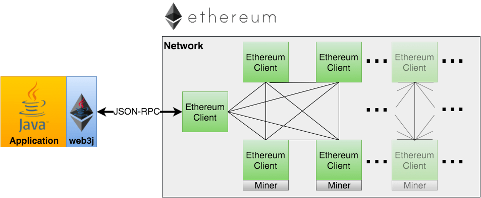

## JSON RPC与web3j

* 如果我们希望构造一个去中心化应用（DApp），除了智能合约的开发， 通常还需要使用其他开发语言为用户提供操作智能合约的用户接口，例如 开发一个网页、一个手机App或者一个桌面应用。这些代码都需要与以太坊 进行交互。

* 以太坊规定了每个节点需要实现的JSON RPC API 应用开发接口，该接口是传输无关的，应用程序可以通过HTTP、websocket或IPC等多种 通信机制来使用该接口协议操作以太坊节点：

* 理论上你可以使用任何语言基于JSON RPC接口开发出以太坊之上的 去中心化应用，不过为了提高开发效率，更好的办法是 使用特定语言的JSON RPC封装库，这些库封装了JSON RPC的协议细节， 有助于开发人员聚焦在业务逻辑的实现上。

* web3j是一个轻量级的用于集成以太坊功能的Java开发库，它是Java版本的以太坊JSON RPC 接口协议封装实现，如果需要将你的Java应用或Android应用接入以太坊，用web3j就对了。