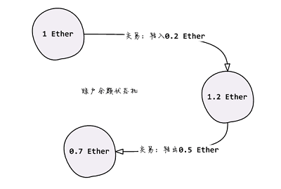

### 状态与交易

在这一部分，我们将学习如何使用web3j向以太坊提交交易，具体包括如下内容：

* 了解以太坊状态机的概念
* 理解普通交易与裸交易的区别
* 提交普通交易
* 提交裸交易
* 交易管理器与受控交易

可以把以太坊视为一个分布式状态机，交易则是以太坊发生状态迁移的 原因，

也就是说，交易总是以修改状态为目的。以太坊中包含成千上万 的状态，账户余额就是其中最著名的一个：

在以太坊中，外部应用可以向节点提交两种交易：普通交易和裸交易。 普通交易由节点签名，而裸交易则由外部应用负责签名。相应的，这两种 交易需要调用不同的接口进行提交。

由于共识机制，向节点提交的交易不会立刻生效，最理想的情况下是被 矿工置入下一个新块。因此交易提交后还需要耐心等待交易凭证。为了简化 两步交易代码，web3j引入了交易管理器与受控交易的概念。