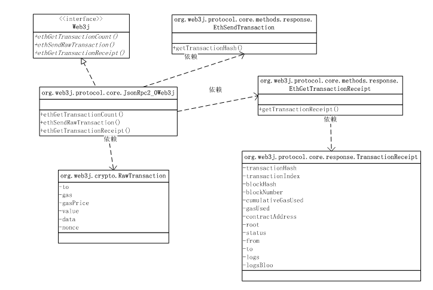

### 状态与交易

在这一部分，我们将学习如何使用web3j向以太坊提交交易，具体包括如下内容：

* 了解以太坊状态机的概念
* 理解普通交易与裸交易的区别
* 提交普通交易
* 提交裸交易
* 交易管理器与受控交易

可以把以太坊视为一个分布式状态机，交易则是以太坊发生状态迁移的 原因，

也就是说，交易总是以修改状态为目的。以太坊中包含成千上万 的状态，账户余额就是其中最著名的一个：


在以太坊中，外部应用可以向节点提交两种交易：普通交易和裸交易。 普通交易由节点签名，而裸交易则由外部应用负责签名。相应的，这两种 交易需要调用不同的接口进行提交。

由于共识机制，向节点提交的交易不会立刻生效，最理想的情况下是被 矿工置入下一个新块。因此交易提交后还需要耐心等待交易凭证。为了简化 两步交易代码，web3j引入了交易管理器与受控交易的概念。

### 状态与激励

如果你把时间想像成离散的，就容易理解什么是状态：


简单的说，状态就是某一个时刻你对所关注的世界的抽象表达的确定值， 而这个值，随时间的延伸或外部的影响可能发生变化。

不同的人眼中有不同的世界，因此也会有不同的抽象表达。例如，如果 我们关注花有没有开，那么我们对这个世界的抽象表达使用一个布尔变量 就够了：在t1 ~ t4，状态的值都是false，而t5和t6时，状态的值则是true， 剔除时间的因素，可以用下面的状态迁移图来压缩表示：


显然，我们关注的世界从一个状态迁移到另一个状态，一定有其原因， 例如，充分的光照。导致状态迁移的原因，在状态迁移图中标注为激励：


有限数量的状态与激励引起的状态迁移，这种模型在计算机领域被称为 有限状态机（FSM），而有限状态机正是以太坊的核心计算模型。

### 以太坊状态机

以太坊将世界抽象为数量巨大的状态节点，而交易则是导致这些状态节点 的值发生变化的激励。

例如，某个账户的余额就是一个状态节点，它的值在某个时刻是确定的， 如果其他人向该账户发起转账交易，那么在下一个时刻，这个状态节点 旳值就会更新为新的值：


以太坊采用一种树形数据结构来保存所有的状态节点，该状态树的根节点则 和交易记录一起保存在区块中。在每一个区块都对应着一棵状态树，它代表 着世界在那个时刻的确定状态 —— 一个快照。

容易理解，状态可以从交易推演出来。例如，要得到一个账户的余额，只需要 把该账户所有的转账交易汇总在一起就可以得出。但以太坊通过使用状态树 来表征交易的结果，使得这一查询可以迅速完成。

### 获取账户余额

以太坊定义了eth_getBalance 接口用来获取账户余额，在web3j中，对应的封装方法为ethGetBalance()， 响应对象为EthGetBalance：


例如，下面的代码读取节点管理的第一个账户的余额：

```
String account = web3j.ethAccounts().send().getAccounts().get(0);
BigInteger balance = web3j.ethGetBalance(account,
                        DefaultBlockParameterName.LATEST).send().getBalance();
```

注意ethGetBalance()方法的第二个参数，使用它来指定一个特定的块。 DefaultBlockParameterName.LATEST这个值表示使用链上的最后一个块，也就 意味着它使用最后一个块的状态树中记录的账户余额，即当前账户余额：


由于每个块都有对应着块生成那一时刻的状态树，因此你指定一个不同的块，就意味着 将账户余额这个状态回溯到那个块生成的特定时刻。例如，查看这个账户 最初的余额：


```
String account = web3j.ethAccounts().send().getAccounts().get(0);
BigInteger balance = web3j.ethGetBalance(account,
                        DefaultBlockParameterName.EARLIEST).send().getBalance();
```

也可以使用编号来指定块，例如，查看第12块时的账户余额：

```
String account = web3j.ethAccounts().send().getAccounts().get(0);
BigInteger balance = web3j.ethGetBalance(account,
                        new DefaultBlockParameterNumber(12L)).send().getBalance();
```

### 以太坊货币单位

如果你成功打印输出了节点账户的余额，可能会吓一跳，怎么这么多钱！

```
balance@latest: 100000000000000000000
```

嗯，通货膨胀 :|)

ethGetBalance()方法返回的数字，其单位为wei，是以太币众多面值单位中 最小的一只，而我们常说的1个以太币，则对应单位ether，这两者之间差着 18个0：
```
1 ether = 1000000000000000000 wei
```
因此上面的账户余额，按ether计算，就是100个以太币了 —— 默认情况下，ganache 创建的测试账户自动充值100个以太。

以太坊定义了10个等级的面值单位，连续两个单位之间总是差3个0，也就是1000倍 的关系。下表列出了常用的单位：


|单位       |单位价值         |  换算为wei     |
| -------------|:--------------:|-------:|
|wei|1 wei| 1 |
|Kwei(babbage)|1e3 wei| 1,000 |
|Mwei(lovelace)|1e6 wei|1,000,000  |
|Gwei(shannon)|1e9 wei| 1,000,000,000 |
|microether(szabo)|1e12 wei|1,000,000,000,000|
|milliether(finney)|1e15 wei| 1,000,000,000,000,000 |
|ether|1e18 wei|1,000,000,000,000,000,000|


值得指出的是，这些货币单位的名称，大多取自在计算机与密码学领域做出杰出 贡献的科学家的名字。例如：wei取自Wei Dai，戴伟，密码学家，B-Money发明人：


wei dai

这个有必要顶一下，华人的骄傲！

其他的还有：

* lovelace：Ada Lovelace，诗人拜伦之女，据称是第一个女程序员
* babbage：Charles Babbage，英国数学家、发明家、机械工程师，提出了 差分机与分析机的概念设计，被视为计算机先驱
* shannon：Claude Elwood Shannon，美国数学家、电子工程师和密码学家， 现代信息论的创始人
* szabo：Nick Szabo，密码学家，智能合约概念的提出者
* finney：Hal Finney，密码学家，提出了工作量证明机制（POW）
* ether则取自从古希腊开始就被认为是构成天体的神秘物质，一直到19世纪科学家 都认为宇宙中充满了以太，认为光是通过以太传播的 —— 当然，现在这种观点已经被 抛弃了。


### 货币单位表示与换算


在org.web3j.utils.Convert类中，定义了枚举类型Unit来表示以太坊 的各种货币单位，例如：

* Convert.Unit.WEI
* Convert.Unit.KWEI
* Convert.Unit.MWEI
* Convert.Unit.GWEI
* Convert.Unit.SZABO
* Convert.Unit.FINNEY
* Convert.Unit.ETHER
* Convert.Unit.KETHER
* Convert.Unit.METHER
* Convert.Unit.GETHER

由于在运算中通常使用wei作为计量单位，Convert类同时也提供了两个静态 方法用于将其他单位换算到wei，或者反之：


例如，下面的代码将1个ether为wei计量的值：


```
BigDecimal oneEther = Convert.toWei("1",Convert.Unit.ETHER);
```
下面的代码将1 wei转换为ether计量的值：


```
BigDecimal oneWei = Convert.fromWei("1",Convert.Unit.ETHER);
```

如果你需要进行转换的两个单位中不包含wei，那么可以结合以上 两个函数，先转化到wei，再转化到目标单位。

### 交易类型

在以太坊中，约定了两种交易：普通交易（Transaction）和裸交易（RawTransaction）。

这两种交易的区别在于：普通交易由节点负责签名，然后发送到网络中进行确认；


而裸交易则由外部应用进行签名，节点不再额外处理，而只是负责发送到网络中进行确认 —— 这也是裸交易名称的由来 —— 未经节点加工的原始交易：


以太坊约定了两种交易不同的提交接口：普通交易使用eth_sendTransaction 调用提交，而裸交易则应当使用eth_sendRawTransaction调用提交。事实上， 在公共节点中，通常会拒绝普通交易的提交，而要求外部应用必须进行离线签名。

### 提交普通交易

普通交易由节点负责进行签名。在web3j中，提交一个普通交易，需要使用 ethSendTransaction()方法发送一个Transaction对象，该方法对应 eth_sendTransaction 这个RPC接口：


应用首先应当准备一个Transaction对象，该对象中包含了四种信息：

* 交易基本信息：发送方、接收方、发送金额
* 有偿执行交易的报酬信息：gas价格、gas用量上限
* 交易标识信息：nonce，用来对抗重放攻击
* 补充数据信息：交易额外携带的数据，也将写入区块永存

不过只有发送方和接收方的信息是必须的，其他不需要的信息都可以设置为null。例如， 下面的代码从节点第1个账户向第2个账户转100wei的资金：


```
List<String> accounts = web3j.ethAccounts().send().getAccounts();
String from = accounts.get(0);
String to = accounts.get(1);
BigInteger gasPrice = null;
BigInteger gasLimit = null;
BigInteger value = BigInteger.valueOf(100L); //wei
BigInteger nonce = null;
String data = null;
Transaction tx = new Transaction(from,nonce,gasPrice,gasLimit,to,value,data);
String txHash = web3j.ethSendTransaction(tx).send().getTransactionHash();
```

向节点成功发送交易对象后，节点将返回该交易的哈希值。我们将在 下一节课程中，使用这个交易哈希值，来检查交易的执行状态。

### 获取交易收据

由于以太坊的交易需要提交到网络中进行共识处理，因此我们提交的交易不会 马上生效。要查询交易是否生效，需要使用ethSendTransaction()方法返回 的交易哈希读取交易收据。

> 根据以太坊的约定，应用需要调用eth_getTransactionReceipt 接口来检索具有指定哈希交易的收据。在web3j，该请求对应ethGetTransactionReceipt() 方法，响应则对应EthGetTransactionReceipt类：


例如，下面的代码尝试读取具有指定哈希的交易的收据：


```
Optional<TransactionReceipt> receipt = web3j.ethGetTransactionReceipt(txHash)
                                            .send().getTransactionReceipt();
```

按照以太坊的出块速度，大约最快需要15秒交易才可能得到确认，因此我们需要 周期性地检查交易收据。例如，下面的代码每隔10秒钟检查一次交易收据， 直到超时或取得有效收据：

```
long timeout = 300000L;
long t0 = System.currentTimeMillis();
Optional<TransactionReceipt> receipt = null;
while(true){
  receipt = web3j.ethGetTransactionReceipt(txHash).send().getTransactionReceipt();
  if(receipt.isPresent()) { break;}
  if((System.currentTimeMillis() - t0) > timeout) {  break; }
  Thread.sleep(1000*10);
}

```

当然，在使用ganache时，由于出块速度非常块，可以提高检查频率，例如每隔1秒 检查一次即可。

### gas价格与用量

在我们之前创建交易对象时，有意忽略了gas相关的参数，让节点自己决定。 因为，gas是以太坊中最令人迷惑的概念之一。

> Gas：Gas对应于一个交易(Transaction)中以太坊虚拟机(EVM)的实际运算步数。 越简单的交易，例如单纯的以太币转帐交易，需要的运算步数越少， Gas亦会需要 的少一点。 反之，如果要计算一些复杂运算，Gas的消耗 量就会大。

> Gas Price：Gas Price就是你愿意为一个单位的Gas出多少Eth，一般用Gwei作单位。 所以Gas Price 越高， 就表示交易中每运算一步，会支付更多的Eth。

因此，以太坊的交易手续费计算公式很简单：

> 交易手续费(Tx Fee) = 实际运行步数(Actual Gas Used) * 单步价格(Gas Price)
例如你的交易需要以太坊执行50步完成运算，假设你设定的Gas Price是2 Gwei ，那么整个 交易的手续费 就是50 * 2 = 100 Gwei 了。

> Gas Limit：Gas Limit就是一次交易中Gas的可用上限，也就是你的交易中最多会执行多少步运算。 由于交易复杂程度各有不同， 确切的Gas消耗量是在完成交易后才会知道，因此在你提交交易 之前，需要为交易设定一个Gas用量的上限。


#### web3j中为交易设置gas参数

在web3j中创建Transaction对象时，可以根据具体情况设定gas Price为20GWe，设定gas Limit 为60000：


```
List<String> accounts = web3j.ethAccounts().send().getAccounts();
String from = accounts.get(0);
String to = accounts.get(1);
BigInteger gasLimit = BigInterger.valueOf(60000);
BigInteger gasPrice = Convert.toWei("20",Convert.Unit.GWEI).toBigInteger();
BigInteger value = BigInteger.valueOf(100L); //wei
BigInteger nonce = null;
String data = null;
Transaction tx = new Transaction(from,nonce,gasPrice,gasLimit,to,value,data);
String txHash = web3j.ethSendTransaction(tx).send().getTransactionHash();

```

如果说你提交的交易尚未完成，消耗的Gas就已经超过你设定的Gas Limit，那么这次交易 就会被取消，而已经消耗的手续费同样被扣取 —— 因为要奖励已经付出劳动的矿工。 而如 果交易已经完成，消耗的Gas未达到Gas Limit， 那么只会按实际消耗的Gas 收取交易服务费。 换句话说，一个交易可能被收取的最高服务费就是Gas Limit * Gas​​ Price 了。

最后值得一提的是Gas Price 越高，你提交的交易会越快被矿工接纳。 但通常人们都不愿多支付手续费， 那么究竟应该将Gas Price设置为多少，才可以在正常时间(eg 10 mins)内，确保交易被确认到区域链上 呢？ 这个网 [https://ethgasstation.info] 可以帮到你。

### 使用裸交易

与普通交易由节点负责签名不同，裸交易需要外部应用进行离线签名。 因此在使用裸交易之前，需要首先载入账户凭证 —— 要用到凭证里 保存的私钥进行签名：


可以使用钱包来实例化一个账户凭证对象，例如，下面的代码使用 密码123解密指定的钱包文件：

```
Credentials credentials = WalletUtils.loadCredentials("123","./keystore/...");
```

接下来创建裸交易对象。由于发送方将对裸交易签名，因此在裸交易对象中不需要 重复指定发送方账户。例如，下面的代码将构造一个从钱包账户向节点第2个账户转账 的裸交易对象：

```
List<String> accounts = web3j.ethAccounts().send().getAccounts();
String to = accounts.get(1);
BigInteger gasPrice = BigInteger.valueOf(22000000000L);
BigInteger gasLimit = BigInteger.valueOf(670000);
BigInteger value = Convert.toWei("1",Convert.Unit.ETHER).toBigInteger();
String data = "";
BigInteger nonce = getNonce(credentials.getAddress());
RawTransaction rawTx = RawTransaction.createTransaction(nonce,gasPrice,gasLimit,to,value,data);
```


nonce的作用是对抗重放攻击，在不同的交易中它应当是不重复的，除非你需要覆盖之前 的交易。在以太坊中应当将这个值设置为发送方账户已经发送的交易数量 —— 使用 eth_getTransactionCount 调用来获取这个值：

```
function getNonce(String account) Throws Exception {
  return web3j.ethGetTransactionCount(account,DefaultBlockParameterName.LATEST)
                        .send().getTransactionCount();
}
```

一旦创建了裸交易对象，就可以使用发送方账户对其进行签名，签名的结果是一个 字节码流：

```
byte[] signedMessage = TransactionEncoder.signMessage(rawTx,credentials);
String hexValue = Numeric.toHexString(signedMessage);
```

Numeric.toHexSting()方法的作用，是将字节数组转换为带0x前缀的16进制字符串。

一切就绪，使用ethSendRawTransaction()方法来构建裸交易请求对象：


```
String txHash = web3j.ethSendRawTransaction(hexValue).send().getTransactionHash();
```

同样，我们也需要等待裸交易生效后的收据。

与裸交易相关的主要类及关系如下图所示：





### 受控交易与交易管理器

从前面的文章中容易看到，在应用中执行以太坊交易反复出现这样的模式 —— 提交交易、等待收据：


如果把这两个环节封装起来，可以极大地简化应用代码的编写。事实上， 这就是web3j中的受控交易 —— ManagedTransaction。


受控交易是一个抽象类，我们使用Transfer类来展示受控交易类的简洁，它是封装了 资金转账逻辑的受控交易类，使用其sendFunds()方法进行资金转账操作。

例如，下面的代码从节点管理的第1个账户向第1个账户转入0.1个ether：

```
List<String> accounts = web3j.ethAccounts().send().getAccounts();
String from = accounts.get(0):
String to = accounts.get(1);
BigDecimal value = BigDecimal.valueOf(0.1);
ClientTransactionManager ctm = new ClientTransactionManager(web3j,from);
Transfer transfer = new Transfer(web3j,ctm);
TransactionReceipt receipt = transfer.sendFunds(to,value,Convert.Unit.ETHER).send();
```

Transfer类实现了受控转账交易，其sendFunds()方法返回一个RemoteCall对象 该返回对象的send()方法将真正触发以太坊交易的发送。

可以看到，我们在调用sendFunds().send()提交交易后，直接得到了交易收据，这 意味着，这个调用的内部，帮我们进行了繁琐的收据等待处理。

由于我们使用节点管理的账户，因此使用ClientTransactionManager，其构造函数 需要传入发送方的账户。

```
ClientTransactionManager ctm = new ClientTransactionManager(web3j,from);
```

对交易收据的等待是在交易管理器里完成的。在交易管理器中将在发送交易后启动一个 线程等待并最终返回交易收据。

默认情况下，web3j交易管理器将以15秒的周期最多检查40次交易收据。15秒是以太坊默认的 出块时间。你可以在创建交易管理器时修改这两个参数。例如，下面的代码将以1秒的 周期检查10次 —— 在使用仿真器时，这是合理的参数：

```
int from = accounts.get(0):
int attempts = 10;
int sleepDuration = 1000; //ms
ClientTransactionManager ctm = new ClientTransactionManager(web3j,from,attempts,sleepDuration);
```

### 裸交易管理器

web3j的交易管理器不仅封装了两步交易操作，而且还使用不同的继承类封装了 不同的交易签名方式：


例如，在上一节使用的ClientTransactionManager类，它将向节点提交普通 交易，由节点负责签名后再发送到网络中。因此，在它的构造函数中，只需要 声明执行账户即可：


```
String account = accounts.get(0);
ClientTransactionManager ctm = new ClientTransactionManager(web3j,accounts.get(0));
```

与此对应，RawTransactionManager类则使用应用管理的私钥执行离线签名， 然后提交裸交易给节点。因此，在它的构造函数中，需要指定的是账户凭证 Credentials对象：


```
String pass = "123";
String walletPath = "./keystore/...";
Credentials credentials = WalletUtils.loadCredentials(pass,walletPath);
RawTransactionManager rtm = new RawTransactionManager(web3j,credentials);
```

同样，你也可以调节裸交易管理器的收据等待行为：

```
int attempts = 10;
int sleepDuration = 1000; //ms
RawTransactionManager rtm = new RawTransactionManager(web3j,credentials,attempts,sleepDuration);
```