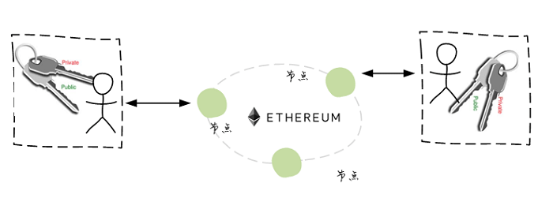
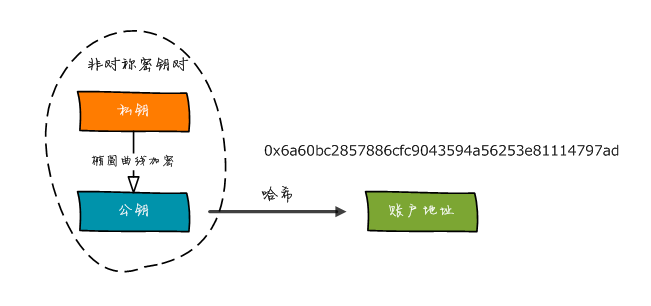
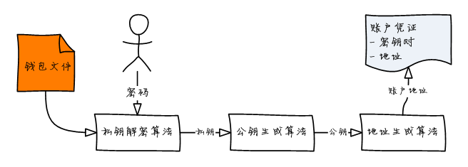
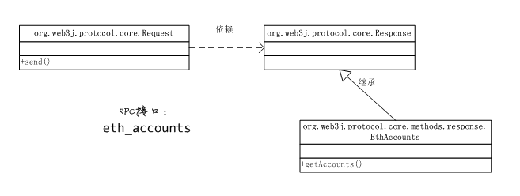

## 使用web3j管理以太坊账户

* 了解私钥、公钥和账户的关系
* 离线创建以太坊账户
* 导入其他账户私钥
* 创建和使用钱包
* 创建和使用账户凭证
* 读取节点管理的账户列表


以太坊作为一个去中心化的系统，必然不会采用中心化的账户管理 方案 —— 没有一个中心数据库来保存以太坊平台上的所有账户信息。 事实上，以太坊使用非对称密钥技术来进行身份识别，一个以太坊 账户对应着一对密钥：



web3j中账户管理的功能主要由org.web3j.crypto包实现，常用的类 包括：

* ECKeyPair：表征密钥对的类

* WalletUtils：钱包辅助类

* Credentials：账户凭证类

可以使用ECKeyPair来创建新的密钥对，或者导入已有的私钥； WalletUtils可以用来生成或载入钱包文件，而Credentials则 包含了一个账户的全部标识信息，是执行交易的主体。


### 私钥、公钥与账户

以太坊使用非对称密钥对来进行身份识别，每一个账户都有 对应的私钥和公钥 —— 私钥用来签名、公钥则用来验证签名 —— 从而 在非可信的去中心化环境中实现身份验证。

事实上，在以太坊上账户仅仅是对应于特定非对称密钥对中公钥的20字节 哈希：




从私钥可以得到公钥，然后进一步得到账户地址，而反之则无效。 显然，以太坊不需要一个中心化的账户管理系统，我们可以根据以太坊约定 的算法自由地生成账户。


### 创建账户


>在web3j中，使用org.web3j.crypto.Keys类来创建账户：

```
//例如，下面的代码创建一个密钥对，然后生成账户地址。
//注意Keys 类的createEcKeyPair()和getAddress()都是静态方法：
ECKeyPair keyPair = Keys.createEcKeyPair();
String privateKey = keyPair.getPrivateKey().toString(16);
String publicKey = keyPair.getPublicKey().toString(16);
String account = Keys.getAddress(keyPair);

```

>getAddress()方法有多个重载版本：

* public static String getAddress(ECKeyPair ecKeyPair)
* public static String getAddress(BigInteger publicKey)
* public static String getAddress(String publicKey)
* public static byte[] getAddress(byte[] publicKey)

>显然，只需要公钥就可以获得对应的账户地址了。例如：

```
String publicKey = keyPair.getPublicKey().toString(16);
String account = Keys.getAddress(publicKey);
```

钱包文件中保存的是加密后的私钥，显然，只要持有生成钱包文件时的密码， 就可以恢复私钥，进而重新获得公钥和账户地址：



下面的代码则使用WalletUtils类的loadCredentials()静态方法载入指定的钱包文件， 该方法返回一个Credentials凭证对象，此对象中包含了密钥对和账户地址信息：

```
Credentials credentials = WalletUtils.loadCredentials(pass,
"./keystore/UTC--2018-05-31T05-08-22.474000000Z--d912aecb07e9f4e1ea8e6b4779e7fb6aa1c3e4d8.json");
ECKeyPair keyPair = credentials.getEcKeyPair();
String account = credentials.getAddress();
```

凭证Credentials非常重要，因为在我们向以太坊提交交易时，总需要使用私钥 进行签名，而在Web3j中，通常使用凭证对象传入执行签名的方法。

除了通过载入钱包文件来实例化，也可以直接构建凭证对象。Credentials类提供 了静态方法create()的几种重载形式，可以使用私钥或密钥对来实例化凭证对象：

* public static Credentials create(ECKeyPair ecKeyPair)
* public static Credentials create(String privateKey, String publicKey)
* public static Credentials create(String privateKey)

### 节点管理的账户

除了在web3j中离线创建账户，也可以使用节点管理账户。例如，geth、parity 等节点软件都提供了创建账户的用户接口和开发接口，ganache则会自动创建了一些 可供测试用的账户。

公共节点（例如Infura）通常不支持你直接使用它的节点管理账户，因此必须 自己离线创建账户。一个简单的例子就是Metamask钱包。Metamask就是使用的 Infura公共节点，因此它采用的是离线方式创建账户；与之相对应，如果你部署 私有节点，那么即可以使用节点软件创建账户，当然也可以离线创建账户。

以太坊的eth_accounts 接口用来获取节点管理的账户，在web3j中，对应的封装方法为ethAccounts， 响应对象为EthAccounts：



例如，下面的代码获取节点管理的账户列表：

```
Request<?,EthAccounts> request = web3j.ethAccounts();
EthAccounts ethAccounts = request.send();
List<String> accounts = ethAccounts.getAccounts();
```

或者采用链式写法简便地改写为：

```
List<String> accounts = web3j.ethAccounts().send().getAccounts();
```