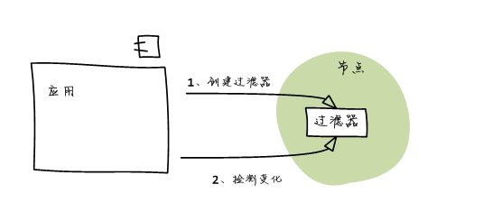
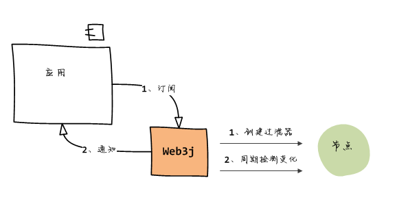
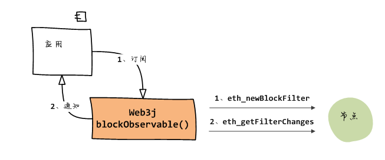
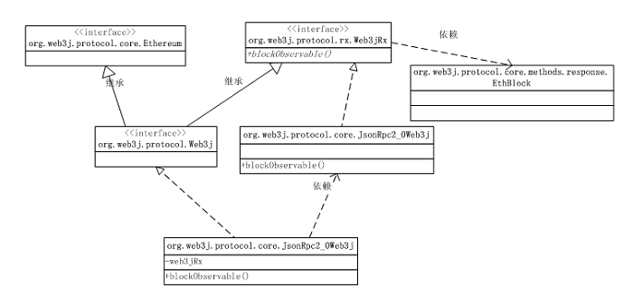
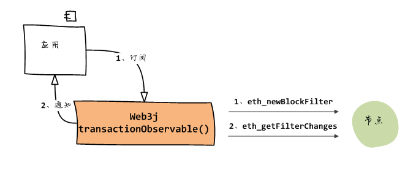
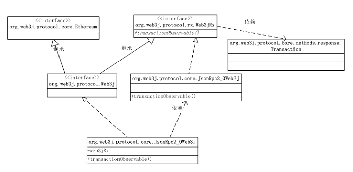
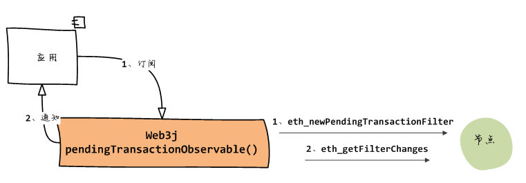
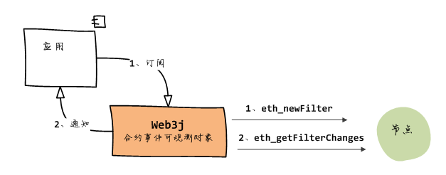

## 过滤器与事件

### 通知机制概述

知机制对任何应用开发都很重要，因为它提供了另外一个方向的变化 通知能力。以太坊也不例外，它的通知机制增强了智能合约与外部应用之间 的沟通能力。

以太坊的通知机制是建立在日志基础之上。例如，如果智能合约触发了一个 事件，那么该事件将写入以太坊日志；如果外部应用订阅了这个事件，那么 应用就可以在日志中出现该事件后及时检测到：




> 需要指出的是，以太坊的通知机制不是推（Push）模式，而是需要外部应用 周期性轮询的拉（Pull）模式。外部应用通过在节点中创建过滤器来订阅感兴趣 的日志，之后则通过检测该过滤器的变化获得最新的日志。

> 更经典的通知机制应该是推模式的，因此web3j在此基础上进行了封装，使用RxJava 实现了观察者模式的通知机制：当发生感兴趣的事件时，web3j会自动将事件推送 给应用：



在这一部分的课程中，我们将学习以下内容：

* 使用块过滤器监听新块生成事件和新交易事件
* 使用待定交易过滤器监听待定交易事件
* 使用合约包装类监听合约事件

### 监听新块事件

使用块过滤器来监听新块生成事件。其过程如下：



Web3j的blockObservable()方法将创建一个块事件可观测对象，其参数为true时， 表示在通知事件中将包含完整的交易数据，否则仅包含交易哈希。

例如，下面的代码将在出现新块时打印新块的哈希和编号：

```
Subscription sub = web3j.blockObservable(true).subscribe(ethBlock -> {
  EthBlock.Block block = ethBlock.getBlock();
  System.out.println("hash: " + block.getHash());
  System.out.println("number: " + block.getNumber());
});
```

注意通知的参数类型为EthBlock，需要使用getBlock()方法来提取 具体的块信息对象，它的类型是EthBlock.Block。

#### 设置轮询周期

默认情况下，web3j的轮询周期为15秒 —— 以太坊的平均出块时间。如果 我们使用ganache仿真器，会感到事件的触发太慢了 —— 实际上web3j压根 还没有去检查有没有变化的日志。

我们可以在创建Web3j实例时调整这个轮询周期。例如，下面的代码创建 的Webj实例，将每秒检查一次日志变化，这会让事件的触发更加及时：

```
import org.web3j.utils.Async;
Web3j web3j = Web3j.build(new HttpService("http://localhost:8545"),1000,Async.defaultExecutorService());
```

web3j的相关类及关系如下图：



#### 监听新交易事件

使用交易过滤器来监听新交易事件。其过程如下：




你可能注意到transactionObservable()的实现也是调用eth_newBlockFilter 创建的块过滤器，实际上它就是在捕捉到新块事件后，直接展开块中的交易对象。

使用Web3j的transactionObservable()方法创建一个交易事件可观测对象， 其通知参数是Transaction对象。

例如，下面的代码将打印新确认交易的哈希、发送账户和接收账户：


```
Subscription sub = web3j.transactionObservable().subscribe(tx -> {
  System.out.println("hash: " + tx.getHash());
  System.out.println("from: " + tx.getFrom());
  System.out.println("to: " + tx.getTo());
});
```

web3j的相关类及关系如下图：




#### 监听待定交易事件

使用待定交易过滤器来监听新待定交易事件。其过程如下：




Web3j的pendingTransactionObservable()方法创建一个可观测对象， 它向观察者传入的参数类型为Transaction。

例如，下面的代码将打印新出现的待定交易的哈希：


```
Subscription sub = web3j.pendingTransactionObservable().subscribe(tx -> {
  System.out.println("hash: " + tx.getHash());
});
```

web3j的相关类及关系如下：


#### 合约事件

Solidity合约中可以声明事件，并在合适的时机触发事件。

例如，我们可以在投票合约中声明一个Vote事件，当投票时将触发该事件：

```
pragma solidity ^0.4.24;

contract Voting {

  mapping (bytes32 => uint8) public votes;
  bytes32[] public candidates;
  //声明事件Vote
  event Vote(address voter, bytes32 candidate);

  constructor(bytes32[] candidateNames) public {
    candidates = candidateNames;
  }

  function getVotesFor(bytes32 candidate) view public returns (uint8) {
    require(validCandidate(candidate));
    return votes[candidate];
  }

  function voteFor(bytes32 candidate) public {
    require(validCandidate(candidate));
    votes[candidate]  += 1;
    //触发事件Vote
    emit Vote(msg.sender, candidate);
  }

  function validCandidate(bytes32 candidate) view public returns (bool) {
    for(uint i = 0; i < candidates.length; i++) {
      if (candidates[i] == candidate) {
        return true;
      }
    }
    return false;
   }
}
```

#### 监听合约事件

合约事件的监听是通过主题过滤器实现的，其过程如下：




例如，对于Voting合约中的事件Vote，web3j包装类中将自动为其生成 对应的可观测对象生成函数voteEventObservable()。使用代码如下：


```
EthFilter filter = new EthFilter();
voting.voteEventObservable(filter).subscribe(event -> {
  System.out.println(event.voter + " : " + new String(event.candidate));
});
```

虽然也可以使用ethLogObservable()方法创建一个主题日志可观测对象 来接收合约事件，例如：

```
EthFilter filter = new EthFilter();
web3j.ethLogObservable(filter).subscribe(log -> {
  Systet.out.println("index: " + log.getIndex());
  Systet.out.println("data: " + log.getData());
})
```

但捕捉到的日志还需要进一步解码才可以得到事件的参数，因此，除非特殊情况， 我们总是应该使用包装类中的功能。


