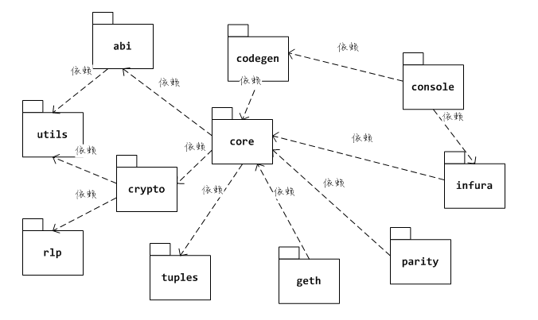

## org.web3j

web3j的功能组织在不同的包中，下图展示了org.web3j主要包之间的依赖关系：

core：JSON RPC协议的封装主要由包org.web3j.core实现，它依赖于org.web3j.crypto包提供 的密钥与签名相关的功能，以及org.web3j.abi包提供的java/solidity类型映射支持。

console：org.web3j.console包实现了一个可以单独运行的命令行程序web3j，我们将使用它来 生成solidity合约的Java封装类，其中，org.web3j.codegen包实现了从abi到java封装类的代码生成。

节点相关：org.web3j.infura包封装了对Infura公共节点旳http访问服务接口， org.web3j.geth和org.web3j.parity则分别封装了这两种常用以太坊节点软件旳管理接口。

