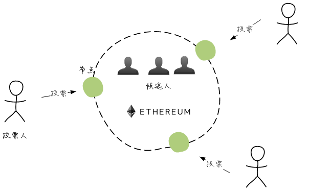
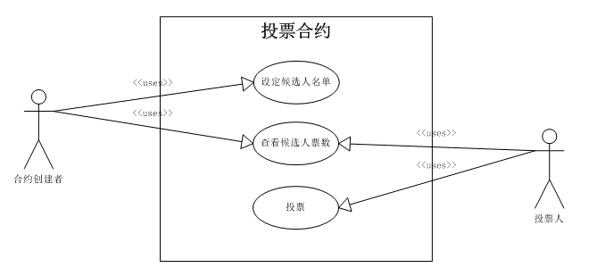
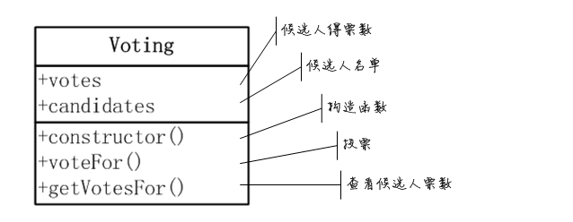
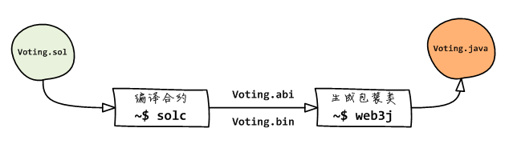
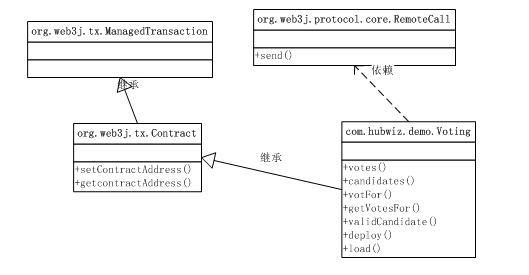

## 智能合约

### 智能合约概述

智能合约就是区块链上运行的软件，它常常被类比为「自动贩卖机」，因为大家认为这样比较容易理解： 自动贩卖机能接受并执行外部的指令。当顾客选定商品并付款后， 自动贩卖机将释放商品给顾客， 并不需要额外的人工介入：


智能合约的概念最早由电脑科学家、密码学家Nick Szabo在1994年提出， 不过当时并没有合适的环境实现。由于区块链上的交易具有可追溯、抗篡改、不可逆转的特性， 使智能合约在没有第三方中间人的情况下，也可以进行安全的交易，这才使得自动化执行的智能合约得以落地。

而以太坊由于内置了虚拟机和开发语言，这使得在以太坊区块链上开发智能合约的效率大大提高、难度 大大降低。因此，现在提到智能合约，基本上大家说的都是以太坊上的智能合约。

在这一部分的课程中，我们将学习以下内容：

* 使用solidity开发一个投票智能合约
* 使用命令行工具将solidity智能合约编译、转化为java包装类
* 编写部署合约的java代码
* 在java代码中与智能合约交互

### 去中心化投票

投票是集体决策的一种重要形式，在去中心化的系统中，由于剔除了中心化 的权威机构，来自不同个体的投票在很多应用中都发挥着重要的作用。下图 是基于以太坊的去中心化投票的示意图：



在这个去中心化投票系统中有两个角色：合约创建者和投票人。候选人名单是固定 的，由合约创建者在部署合约时设定，我们使用字符串来表示候选人；投票人则只能 投票给名单中的候选人，我们使用以太坊账户来表示投票人；合约创建者和投票人 都可以查看候选人的得票数：



### 设计合约接口

Solidity合约非常类似于Java中的类：属性用来声明合约的状态，方法用来修改或 读取状态。因此我们很容易根据前一节的用例设计出投票合约的主要接口：



我们肯定需要记录每个候选人的得票数，这就是votes状态的作用；而 candidates状态则用来记录所有的候选人名称。

voteFor()方法是为投票人服务的，而getVoteFor()方法则用来获取某个 候选人的得票数，至于设定候选人名单，我们将在构造函数中完成。

### 编写合约代码

首先我们创建合约文件Voting.sol。.sol后缀表示这是一个solidity代码文件。 遵循gradle的目录约定，我们将这个文件放在src/main/resources/solidity目录下：


```
~/repo/hello$ mkdir -p src/main/resources/solidity
~/repo/hello$ touch src/main/resources/solidity/Voting.sol
```
实现代码及注释如下：


```
pragma solidity ^0.4.24;  //编译器版本要求：0.4.x

contract Voting {  // 使用contract关键字定义合约

  mapping (bytes32 => uint8) public votes; //使用映射表记录候选人得票数
  bytes32[] public candidates;    //使用定长数组记录候选人名单         

  //构造函数。参数：候选人名单
  constructor(bytes32[] candidateNames) public { 
    candidates = candidateNames;
  }

  //获取指定候选人得票数。参数：候选人名称。返回值：8位无符号整数
  function getVotesFor(bytes32 candidate) view public returns (uint8) {
    require(validCandidate(candidate));//要求指定名称必须是有效候选人，否则停止执行
    return votes[candidate];
  }

  //投票给指定候选人。参数：候选人名称
  function voteFor(bytes32 candidate) public {
    require(validCandidate(candidate)); 
    votes[candidate]  += 1;
  }

  //检查指定的名称是否在候选人名单里。参数：候选人名称。返回值：true或false
  function validCandidate(bytes32 candidate) view public returns (bool) {
    for(uint i = 0; i < candidates.length; i++) {
      if (candidates[i] == candidate) {
        return true;
      }
    }
    return false;
   }
}
```

合约文件的第一句总是用来声明对编译器的要求，solidity中可以使用语义化版本号。 例如：^0.4.24将匹配所有0.4.x版本的编译器。

bytes32[]表示定长字符串（32字节）数组，在Solidity中由于bytes32比string类型 有更小的计算开销，因此我们使用定长字符串来表示候选人名称。

mapping (bytes32 => uint8)定义了一个从定长字符串（键）到无符号8位整数（值） 的映射表类型，因此它很合适记录候选人的得票数。Solidity的映射表非常类似于java中的 哈希表，但不同的是，你无法枚举映射表的键。这是因为映射表实际上是记录的键哈希 到值的映射，因此它只能进行单向检索。

Solidity使用constructor来声明合约的构造函数，这是我们设置候选人名单的时机。

getVotes()方法用来读取指定候选人的得票数，由于这个函数不会修改合约的状态， 因此在函数声明时，使用了view修饰符：


```
function getVotesFor(bytes32 candidate) view public returns (uint8){}
```

该函数同时在声明时使用returns关键字定义了返回值。

在voteFor()和getVoteFor()函数实现内，都使用require()调用来检查 输入条件是否满足函数执行的要求。require语句类似于java中的断言assert， 如果条件不满足，则不会继续执行，但也不会消耗调用账户的gas。

### 生成合约包装类

为了在Java代码中与合约交互，我们需要将solidity合约转化为Java类，流程如下：



#### 编译合约

solidity编译器可以从合约源代码编译出EVM字节码和二进制应用接口（ABI）。 字节码是最终运行在以太坊虚拟机中的代码，而ABI则是描述合约接口的一个JSON 对象，用来在其他开发语言中调用合约。

例如，下面的命令使用--bin和--abi选项声明同时生成字节码和ABI对象， 并输出到build目录：

solc:

```
~/repo/hello$ solc src/main/resources/solidity/Voting.sol --bin --abi \
                   --optimize --overwrite \
                   -o src/main/resources/solidity/build/
```

编译成功后，将在build目录中得到两个文件：

```
~/repo/hello$ ls src/main/resources/solidity/build
Voting.abi Voting.bin
```

接下来，我们将使用这两个文件来生成Java中可以使用的包装类。

#### 生成包装类

一旦生成了合约的字节码和ABI，就可以使用web3j提供的命令行工具来生成包装类。

例如，下面的代码使用之前生成的字节码文件和abi文件，在com.hubwiz.demo.contracts 包中生成对应的包装类：


```
~/repo/hello$ web3j solidity generate \
                    src/main/resources/solidity/build/Voting.bin \
                    src/main/resources/solidity/build/Voting.abi \
                    -p com.hubwiz.demo.contracts \
                    -o src/main/java/
```

现在，就可以在代码中使用Voting类了。例如，在你的java代码中：

```
import com.hubwiz.demo.contracts.Voting;
```

#### 编写合约处理脚本

我们可以编写一个脚本，来简化编译合约、生成包装类这一流程：

```
~/repo/hello$ touch buildContracts.sh
```

buildContracts.sh内容如下：

```
#!/usr/bin/env bash

set -e
set -o pipefail

# 合约代码根目录
srcDir=src/main/resources/solidity
# 合约编译输出目录
abiDir=$srcDir/build/
# java代码根目录
javaDir=src/main/java

# 逐个处理合约代码文件
for file in `ls $srcDir/*.sol`; do
  # 剔除代码文件名后缀
  target=$(basename $file .sol)

  # 编译合约代码
  echo "Compiling Solidity file ${target}.sol"

  solc --bin --abi --optimize --overwrite \
          --allow-paths "$(pwd)" \
          $file -o $abiDir
  echo "Complete"

  # 生成java包装类
  echo "Generating contract bindings"
  web3j solidity generate \
      $abiDir/$target.bin \
      $abiDir/$target.abi \
      -p com.hubwiz.demo.contracts \
      -o $javaDir > /dev/null
  echo "Complete"

done
```

现在，只需执行这个脚本就可以直接编译合约并生成包装类了：

```
~/repo/hello$ ./buildContracts.sh
```

#### 部署/载入合约

生成的合约包装类Voting继承自Contract，而Contract也是一个受控交易对象：




查看生成的Voting.java文件，容易看到与合约中对应的方法，例如voteFor()等，而 合约中的状态则转化为同名函数，例如为votes状态生成的votes()方法。

除此之外，合约包装类中还生成了用于合约部署的静态方法deploy()。例如， 下面的代码部署合约并使用getContractAddress()方法获得合约地址：


```
//使用节点账户部署合约
List<String> accounts = web3j.ethAccounts().send().getAccounts();
ClientTransactionManager ctm = new ClientTransactionManager(web3j,accounts.get(0));
//准备参数：候选人名单
List<byte[]> candidates = new ArrayList<byte[]>();
candidates.add(stringToByte32("Tommy"));
candidates.add(stringToByte32("Jerry"));
candidates.add(stringToByte32("Micky"));
//部署合约
Voting voting = Voting.deploy(web3j,ctm,Contract.GAS_PRICE,Contract.GAS_LIMIT,candidates).send();
//获取合约的部署地址
String contractAddress = voting.getContractAddress();
```

由于我们在solidity合约中使用bytes32定长字符串，因此需要把Java中的String转化为 定长byte[]数组：

```
private static byte[] stringToBytes32(String str){
  byte[] a = new byte[32];
  System.arraycopy(str.getBytes(),0,a,32-str.length(),str.length());
  return a;
}
```

#### 载入已部署合约

我们并不需要每次启动程序都部署一次合约，事实上，更常见的场景， 是在程序启动时载入一个已经部署在链上的合约。

使用合约包装类的load()静态方法载入一个已知地址的已部署合约。例如：

```
String contractAddress = "0x...";
Voting voting = Voting.load(contractAddress,web3j,ctm,Contract.GAS_LIMIT);
```

#### 调用合约方法

web3j在合约包装类中自动生成与solidity合约中对应的方法，我们只需要 直接使用即可。

例如，可以下面的java代码为Tommy投票：

```
TransactionReceipt receipt = voting.voteFor(stringToBytes32("Tommy")).send();

```

由于voteFor()方法修改合约的状态，因此该调用提交的是一个交易， 对应于eth_sendTransaction或eth_sendRawTransaction调用，封装类的对应 方法返回的总是交易收据对象。

另一种情况，下面的代码读取链上Tommy获得的总票数：


```
BigInteger votes = voting.getVotesFor(stringToBytes("Tommy")).send();

```

由于合约的getVotesFor()方法仅读取合约的状态而不进行修改，因此该调用 提交的是消息调用，对应于eth_call调用，也就是说该方法直接在节点虚拟机中运行而 不必同步到网络中的其他节点。因此，封装类的对应方法可以返回solidity合约中 定义的返回值。

#### 使用不同的账户

由于web3j的合约包装类在部署或载入时就绑定了账户，因此如果需要使用多个账户 执行合约方法，例如分别以不同的身份投票，就需要创建不同的包装类实例。

例如，下面的代码分别使用第1个和第2个节点账户进行投票：

```
String contractAddress = "0x...";
List<String> accounts = web3j.ethAccounts().send().getAccounts();
ClientTransactionManager ctm1 = new ClientTransactionManager(web3j,accoutns.get(0));
Voting v1 = Voting.load(contractAddress,web3j,ctm1,Contract.GAS_PRICE,Contract.GAS_LIMIT);
v1.voteFor(string2Byte32("Tommy")).send();
ClientTransactionManager ctm2 = new ClientTransactionManager(web3j,accoutns.get(1));
Voting v2 = Voting.load(contractAddress,web3j,ctm2,Contract.GAS_PRICE,Contract.GAS_LIMIT);
v2.voteFor(string2Byte32("Jerry")).send();
```